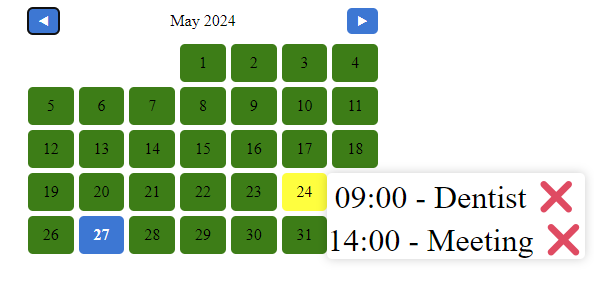
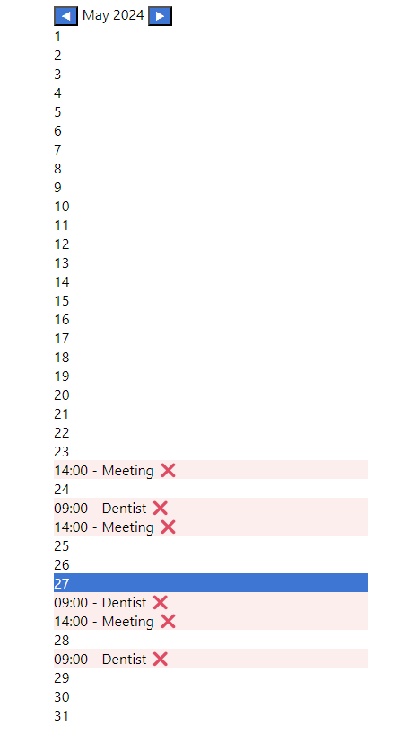

# Interactive Calendar

**Interactive Calendar** is a JavaScript component for an interactive and feature-rich calendar. This component can be easily integrated into other projects to provide calendar functionalities.

## Features

- **Highlight Current Day**: Automatically highlight the current day.
- **Month Navigation**: Browse between months seamlessly.
- **Event Handling**: Accepts a list of events with details such as name, time, and date.
  ```javascript
  const events = [
    { name: "Meeting", time: "14:00", date: "2024-04-05" },
    { name: "Dentist", time: "09:00", date: "2024-04-12" },
  ];
  ```
- **Add New Event**: Add new events by clicking on a date.
- **Remove Events**: Easily remove events from the calendar.
- **Event Sorting**: Events are automatically sorted.
- **Multiple Formats**: Supports multiple calendar formats using different stylings.

## Installation

To install and set up the Interactive Calendar component in your project, follow these steps:

### Prerequisites

Ensure you have the following installed:

- [Node.js](https://nodejs.org/) (v12 or higher)
- [npm](https://www.npmjs.com/) (v6 or higher)

### Setup

1. Clone the repository:

   ```bash
   git clone https://github.com/Sorin-Ionut-Rosalim/interactive-calendar.git
   ```

2. Navigate to the project directory:

   ```bash
   cd interactive-calendar
   ```

3. Install the dependencies:

   ```bash
   npm install
   ```

### Build

To build the project, run the following command:

```bash
npm start
```

This will generate the necessary files in the dist directory.

## Usage

In the index.html are two examples of usages of calendar-component:

1. 
2. 

## GitHub Pages

You can access one of the components hosted on GitHub Pages at the following link:

[Interactive Calendar Component](https://sorin-ionut-rosalim.github.io/interactive-calendar/)

## Contributing

Contributions are welcome! Please follow these steps to contribute:

1. Fork the repository.
2. Create a new branch (`git checkout -b feature/your-feature`).
3. Make your changes and commit them (`git commit -m 'Add some feature'`).
4. Push to the branch (`git push origin feature/your-feature`).
5. Open a pull request.

## License

This project is licensed under the MIT License - see the [LICENSE](LICENSE) file for details.

## Contact

For support or any questions, feel free to contact:

- **Sorin-Ionut Rosalim**
- **Email**: rosalim.sorinionut@gmail.com
